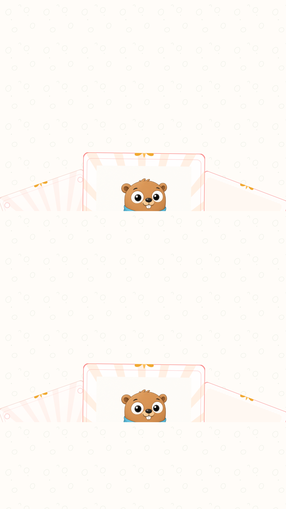

<p align="center">
  
</p>

# Card Reveal

Canvas 2D card/voucher open animation for React. One `requestAnimationFrame` paints the scene; React only re-renders on phase changes (`wait` → `open` → `done`). No Framer, no GSAP.

---

## 1. Overview

**What:** full-screen reveal — tap to open, blade cut, fan of side cards, then zoomable settle pose.

**Themes** (mutually exclusive looks):

| `theme` | Look |
|---------|------|
| `light` | Cream + coral (default) |
| `dark` | Black Gold (`#e8c76a` on charcoal) |

**Phases:** idle breathing → charge/blade → burst + fan → mesmerize (tap card to zoom).

**Fit:** gift unlock, voucher face, birthday/onboarding “open gift”. Drop in as a full-bleed layer over any sized parent.

---

## 2. Usage

### Run the demo

```bash
npm install
npm run dev      # http://localhost:5173 (or next free port)
npm run build
npm test
```

Demo includes a Light / Dark switcher. Tap anywhere to open; tap a card after settle to zoom.

### Embed

Copy `src/features/card-reveal/` into a React + Vite app. Alias `@` → `src` (or fix imports). Parent must have size; the component fills with `position: absolute; inset: 0`.

```tsx
import { CardReveal } from '@/features/card-reveal'

export function GiftScreen() {
  return (
    <div style={{ position: 'fixed', inset: 0, background: '#fffcf8' }}>
      <CardReveal
        theme="light"
        voucher={{
          brand: 'Demo Café',
          title: 'Free drink voucher',
          value: '50.000đ',
          code: 'HELLO-2026',
          expiry: 'Valid until 31/12/2026',
        }}
        fan={{
          left: { text: ['For you', 'Have a lovely day'] },
          right: '/your-cover.png',
        }}
        onOpen={() => {}}
        onComplete={() => {}}
      />
    </div>
  )
}
```

Localize UI copy with `labels` + `brandLocale` (defaults are Vietnamese).

---

## 3. Reference

### Props

| Prop | Type | Default | Notes |
|------|------|---------|-------|
| `image` | `string` | bundled mascot | Main card face art |
| `text` | `string[] \| null` | `null` | Up to 3 lines if no `voucher` |
| `voucher` | `VoucherInfo \| null` | `null` | Brand / title / value / code / expiry |
| `fan` | `FanSlots \| null` | `null` | Side cards; omit = hidden |
| `back` | `string \| null` | `null` | Optional back-face image |
| `theme` | `'light' \| 'dark'` | `'light'` | Palette + canvas backdrop |
| `clickToOpen` | `boolean` | `true` | `false` = auto-loop all scenes |
| `blade` / `bladeGlow` | `string` | from theme | Charge-blade colors |
| `brandLocale` | `string` | `'vi'` | `toLocaleUpperCase` for brand |
| `labels` | `CardRevealLabels` | VI strings | Tap hint + zoom hints |
| `onOpen` / `onComplete` | `() => void` | — | Open start / settle done |

```ts
type VoucherInfo = {
  brand: string
  title: string
  value: string
  code: string
  expiry?: string
}

type FanSlots = {
  left?: { text: string[] } | null  // ≤ 3 lines
  right?: string | null             // image URL
}
```

### Constraints

- Internal design space **1080×1920**, scaled to the canvas.
- Stack: React 19 · Vite 8 · TypeScript · Canvas 2D. Font: Be Vietnam Pro (`fonts.css`; self-host if offline).
- Public entry: `src/features/card-reveal/index.ts` (`CardReveal`, types, `getTheme` / `THEMES`).
- License: personal / demo. Replace sample assets before production.
